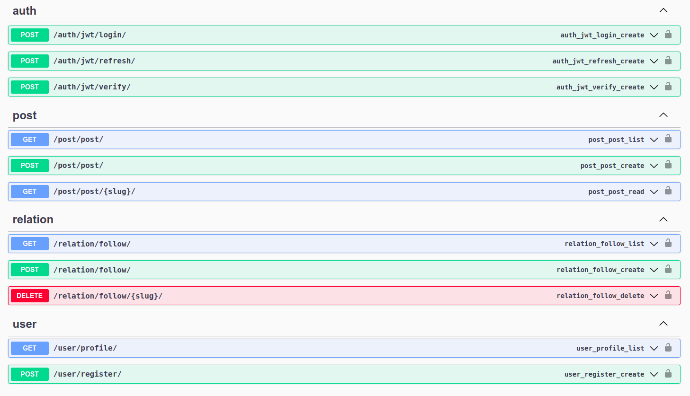

# Blog API
This is a restful API with most of the features of a blog which authors also can follow each other.

## Endpoints



## Installation

* First of all clone the project:
```
git clone https://github.com/EngRobot33/Blog-API.git
```
* Then, we need a virtual environment you can create like this:
```
virtualenv venv
```
* Activate it with the command below:
```
source venv/bin/activate
```
* After that, you must install all of the packages in `requirements.txt` file in project directory:
```
pip install -r requirements.txt
```

* Create a `.env` file in root directory and add your created config:
```python
SECRET_KEY = 'Your secret key generated by https://djecrety.ir'
DEBUG = 'Project debug status'
ALLOWED_HOSTS = ''
REDIS_LOCATION = ''
CELERY_BROKER_URL = ''
```
* After that, migration:
```
python3 manage.py migrate
```
* That's finished now you can run the project:
```
python3 manage.py runserver
```

* Celery and celery beat
```
celery -A apps.task worker -l info --without-gossip --without-mingle --without-heartbeat
celery -A apps.task beat -l info --scheduler django_celery_beat.schedulers:DatabaseScheduler
```

## Contributing
Pull requests are welcome. For major changes, please open an issue first to discuss what you would like to change.

Don't forget to update endpoints photo after each change.


